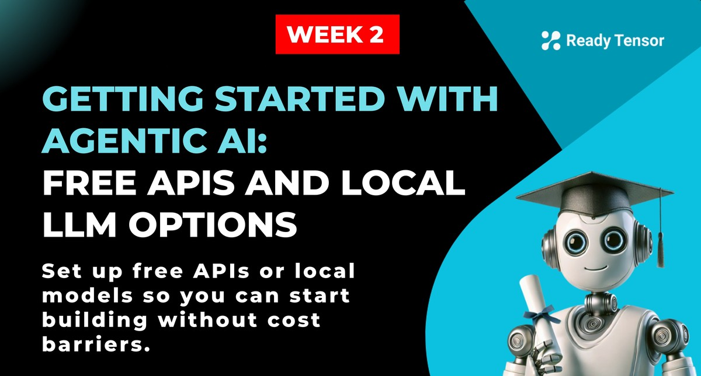

--DIVIDER--

---

[🏠 Home - All Lessons](https://app.readytensor.ai/hubs/ready_tensor_certifications)

[⬅️ Previous - Agents Vs. Workflows](https://app.readytensor.ai/publications/Xq3L2HSWLPou)
[➡️ Next - Building Prompts](https://app.readytensor.ai/publications/36Hu3DC3TLdu)

---

--DIVIDER--

# TL;DR

This lesson shows you how to get started with agentic AI using free LLM options for learning, experimentation, and prototyping. You'll explore APIs from providers like Groq and Google Gemini, or run local models with Ollama—no payments or subscriptions required to follow along. Whether you use Llama, Gemini, or OpenAI models, you have flexible options to support your learning journey.

---

--DIVIDER--

# Getting Ready: Free LLM Options for This Course

In this course, you’ll be using tools like **LangChain** and **LangGraph** to build intelligent, goal-driven AI systems. Many lessons include examples that use OpenAI’s API — a popular option, but one that typically requires a paid subscription.

**Good news:** you can complete this course **without needing to pay for API access**.

We’ve intentionally designed the curriculum with **low usage requirements**, so learners can follow along without hitting paywalls. All major projects and hands-on lessons can be completed using **free-tier API keys** or **local models** that run entirely on your machine.

In this lesson, you’ll learn about two ways to get started without spending anything:

1.  **Use Free API Access**
    Providers like **Groq** and **Google Gemini** offer generous free usage quotas for high-quality LLMs. Some of these even support OpenAI models, so you can stick with familiar prompts while avoiding upfront costs.

2.  **Run Local Models with Ollama**
    If you have a machine with a decent GPU, you can use **Ollama** to download and run open-source models like **Llama 3**, **Mistral**, or **Code Llama** right on your computer. This option gives you full control and zero API limits — perfect for hands-on learners who want to explore under the hood.

We’ll walk you through how to set up each of these options and explain the tradeoffs — from speed and quality to installation complexity and system requirements.

--DIVIDER--

:::info{title="Effortless LLM Switching With LangChain"}

LangChain makes switching between providers seamless, whether you're using Groq, Gemini, OpenAI, or a local model with Ollama. With just a small config change, you can follow the course without rewriting your code or adjusting your prompts — giving you the freedom to choose what works best for you.

:::

---

--DIVIDER--

# Option 1: Use a Free Cloud API

You don’t need to run large language models on your own machine to follow this course. Providers like **Groq** and **Google Gemini** offer **free API access** to high-quality models — no credit card or subscription required.

These cloud APIs are:

- Easy to set up
- Well-supported by LangChain
- Fast enough for real-time use
- Free to use (within generous usage and rate limits)

Let’s start with Groq.

---

--DIVIDER--

## Groq: Fast, Free Access to Open-Source LLMs

**Groq** is an AI infrastructure provider offering free API access to powerful open-source models like Llama 3 and Mixtral, all hosted on their ultra-fast **Language Processing Units (LPUs)**.

You get real-time responses from capable open models — perfect for learning and prototyping.

> ⚠️ Note: Groq’s free tier includes **rate limits and daily caps**. These limits are generous enough for this course, but if you're sending lots of requests, you may occasionally need to wait.

---

--DIVIDER--

### Advantages of Using Groq

- ✅ **Free to use (within limits)** — no credit card required
- ✅ **Fast responses** — LPUs make requests snappy
- ✅ **Developer-friendly** — limits support learning and prototyping
- ✅ **OpenAI-style interface** — easy prompt reuse
- ✅ **LangChain ready** — works out of the box with this course setup

---

--DIVIDER--

### How to Set Up and Use Groq

 <h4> Step 1: Sign Up and Get Your Groq API Key </h4>
 
 1. Go to [https://console.groq.com](https://console.groq.com)
 2. Sign up (no payment info required)
 3. In the dashboard, go to **API Keys**
 4. Click **Create API Key**
 5. Copy your key (starts with `gsk_...`)
 
 ---
 
 <h4> Step 2: Add Your API Key to the Environment </h4>
 
 ```bash
 # Option 1: Add to a .env file
 GROQ_API_KEY=your_key_here
 
 # Option 2: Export it directly in your terminal
 export GROQ_API_KEY=your_key_here
 ```
 
 ---
 
 <h4> Step 3: Install the LangChain–Groq Package </h4>
 
 Install Groq's LangChain integration:
 
 ```bash
 pip install langchain_groq
 ```
 
 ---
 
 <h4> Step 4: Run a Simple Test Script </h4>
 
 Try this simple test script:
 
 ```python
 from langchain_groq import ChatGroq
 
 llm = ChatGroq(model="llama-3.1-8b-instant")
 response = llm.invoke("What is agentic AI?")
 print(response)
 ```
 
 If you see a response in your terminal, you’re good to go.
 
 > 🧪 Try swapping the prompt to something like `"Explain vector databases in one paragraph."`
 > Or test something fun like `"Write a haiku about AI agents."`
 
 ---

--DIVIDER--

## Gemini: Access Google’s LLMs Through a Free Developer Tier

**Gemini** is Google’s suite of powerful large language models — and you can access them via **Gemini API**, using a developer key that you generate through **Google AI Studio**.

You don’t need to enter payment information to get started. The API offers a **free tier** designed for testing, development, and learning — making it a great fit for coursework and experimentation.

> ⚠️ Google’s free tier includes usage limits and rate caps. These are typically generous enough for this course, but they are not meant for production use. If you hit a limit, you can wait for it to reset — or upgrade later if needed.

---

### Advantages of Using Gemini

- ✅ **No billing required to start** — generate an API key instantly with your Google account
- ✅ **Developer-friendly limits** — enough for lessons, prototyping, and experimentation
- ✅ **Good performance on reasoning and coding tasks**
- ✅ **Supports multimodal input** (text, images, etc.)
- ✅ **Works seamlessly with LangChain**

---

### How to Set Up and Use Gemini

 <h4> Step 1: Create Your API Key </h4>
 
 1. Go to [https://makersuite.google.com](https://makersuite.google.com)
 2. Sign in with your Google account
 3. Click **Get API Key**
 4. Choose **Create API Key in new project**
 5. Copy your key — it will look like `AIza...`
 
 ---
 
 <h4> Step 2: Add the Key to Your Environment </h4>
 
 ```bash
 # Option 1: Add to a .env file
 GOOGLE_API_KEY=your_key_here
 
 # Option 2: Export it in your terminal
 export GOOGLE_API_KEY=your_key_here
 ```
 
 ---
 
 <h4> Step 3: Install the Required Package </h4>
 
 ```bash
 pip install langchain-google-genai
 ```
 
 ---
 
 <h4> Step 4: Test Your Setup </h4>
 
 Try this minimal script:
 
 ```python
 from langchain_google_genai import ChatGoogleGenerativeAI
 
 llm = ChatGoogleGenerativeAI(
     model="gemini-2.5-flash",
     temperature=0,
     max_tokens=None,
     timeout=None,
     max_retries=2,
     # other params...
 )
 response = llm.invoke("Explain prompt engineering in simple terms.")
 print(response)
 ```
 
 You should see a clean response — ready to go, with no billing setup.
 
 > 🧪 Tip: Try switching the prompt to `"Give me a metaphor for vector embeddings"` or `"What's a beginner-friendly explanation of LangChain?"`
 
 ---


--DIVIDER--

# Option 2: Run a Local LLM with Ollama

Don’t want to depend on cloud APIs at all? **Ollama** lets you run powerful LLMs like **Llama 3**, **Mistral**, and **Code Llama** locally — with no API keys, no rate limits, and no internet required once models are downloaded.

This is a great option if:

- You want full control over the models you're using
- You’re interested in exploring open models
- You have a machine with enough resources (RAM and GPU)

> ⚠️ Running local models requires decent hardware — especially if you're using larger models. We recommend starting with smaller variants like `llama3:8b` if you’re unsure.

---

### Advantages of Using Ollama

- ✅ **No API calls or rate limits** — everything runs locally
- ✅ **Fully offline** after initial model download
- ✅ **Free and open-source** — no subscriptions or tokens needed
- ✅ **Great for privacy-conscious development and experimentation**
- ✅ **LangChain-compatible** with minimal setup

---

### How to Set Up and Use Ollama

 <h4> Step 1: Install Ollama </h4>
 
 Go to [https://ollama.com](https://ollama.com) and download the installer for your system (macOS, Windows, or Linux).
 
 Follow the instructions to complete installation.
 
 ---
 
 <h4> Step 2: Download a Model </h4>
 
 Once installed, open your terminal and run:
 
 ```bash
 # Recommended starting point
 ollama pull llama3:8b
 ```
 
 Other available models include:
 
 ```bash
 ollama pull mistral
 ollama pull codellama
 ```
 
 These will download and prepare the models for local use.
 
 ---
 
 <h4> Step 3: Install the LangChain Integration </h4>
 
 Install the Ollama LangChain wrapper:
 
 ```bash
 pip install langchain-ollama
 ```
 
 ---
 
 <h4> Step 4: Run a Local LLM Test </h4>
 
 Here’s a minimal example:
 
 ```python
 from langchain_community.chat_models import ChatOllama
 
 llm = ChatOllama(model="llama3:8b")
 response = llm.invoke("Summarize how local models work.")
 print(response)
 ```
 
 This will invoke the LLM running on your machine and return a response — no cloud involved.
 
 > 🧪 Try a fun test prompt like: `"Explain agentic AI like you're a movie trailer narrator."`
 
 ---

--DIVIDER--

:::tip{title="Tip"}
<h4> How to Estimate the Total Memory Needed for a Model </h4>

The total GPU memory required to run a model is the sum of:

$$
\text{Total Memory} \approx \text{Model Weights Size} + \text{Activation Size}
$$
---

1. Model Weights Size

This is the memory needed to store the model’s parameters.
$$
\text{weights\_size\_bytes} = \text{num\_parameters} \times \text{bytes\_per\_parameter}
$$

- num_parameters: Total number of parameters (e.g., 1B, 7B, 20B).
- bytes_per_parameter: Depends on precision (FP32 = 4 bytes, FP16 = 2 bytes, Q8 = 1 byte, Q4 = 0.5 byte).

---

2. Activation Size

Activations are the intermediate outputs stored during the forward pass.

$$ \text{activation\_size\_bytes} \approx \text{num\_layers} \times \text{batch\_size} \times \text{seq\_length} \times \text{hidden\_size} \times \text{bytes\_per\_parameter} $$

- num_layers: Number of transformer layers.
- batch_size: Number of sequences processed at once.
- seq_length: Number of tokens in each sequence.
- hidden_size: Size of the hidden vector in each layer.

---

3. Quantization Factor

Quantization reduces the memory needed for weights by storing parameters in fewer bits.

Adjusted formula for weights with quantization:
$$ \text{weights\_size\_bytes} = \frac{\text{num\_parameters}}{\text{quantization\_factor}} \times \text{bytes\_per\_parameter} $$

- Quantization factor:
- FP32 → 1 (no reduction)
- Q8 → 2 (50% smaller than FP16, 75% smaller than FP32)
- Q4 → 4 (75% smaller than FP16, 87.5% smaller than FP32)

---

Example: 1B Model

Assume:
- Parameters = 1B
- Precision = FP32 (4 bytes)
- Batch size = 8
- Sequence length = 512
- Hidden size = 1024
- Layers = 24

Weights:
$$1,000,000,000 \times 4 = 4,000,000,000\ \text{bytes} \approx 4\ \text{GB}$$

Activations:
$$24 \times 8 \times 512 \times 1024 \times 4 \approx 384\ \text{MB}$$

Total:
$$4\ \text{GB} + 0.384\ \text{GB} \approx 4.38\ \text{GB}$$


:::

## Memory Requirements Table (FP16 Precision)

| Model Size | Parameters | Weights Memory (FP16) | Typical Activation Memory* | Total Memory (Approx.) |
|------------|------------|----------------------|---------------------------|------------------------|
| **1B**     | 1B         | ~2 GB                | ~50-100 MB               | ~2.1 GB                |
| **3B**     | 3B         | ~6 GB                | ~150-300 MB              | ~6.3 GB                |
| **7B**     | 7B         | ~14 GB               | ~350-700 MB              | ~14.7 GB               |
| **8B**     | 8B         | ~16 GB               | ~400-800 MB              | ~16.8 GB               |
| **13B**    | 13B        | ~26 GB               | ~650-1.3 GB              | ~27.3 GB               |
| **20B**    | 20B        | ~40 GB               | ~1-2 GB                  | ~42 GB                 |
| **30B**    | 30B        | ~60 GB               | ~1.5-3 GB                | ~63 GB                 |
| **65B**    | 65B        | ~130 GB              | ~3.25-6.5 GB             | ~136.5 GB              |
| **70B**    | 70B        | ~140 GB              | ~3.5-7 GB                | ~147 GB                |
| **120B**   | 120B       | ~240 GB              | ~6-12 GB                 | ~252 GB                |


# When to Use Which Option

Not sure which path to pick? Here’s the good news: **they all work** — and you can switch at any time.

If you want something fast and cloud-hosted, start with **Groq** or **Gemini**. Prefer full control or want to work offline? Try **Ollama**. You’re not locked in — LangChain makes it easy to change providers without rewriting your code.

|           | **Groq**           | **Gemini**        | **Ollama**            |
| --------- | ------------------ | ----------------- | --------------------- |
| Setup     | Easy cloud setup   | Easy cloud setup  | Requires install      |
| Speed     | Very fast          | Fast              | Varies by hardware    |
| Cost      | Free tier          | Free tier         | Fully free (local)    |
| Limits    | Rate caps apply    | Rate caps apply   | No rate limits        |
| Offline?  | ❌                 | ❌                | ✅                    |
| Great for | Prototyping, speed | Reasoning, coding | Privacy, full control |

There’s no single “best” choice — just pick what fits your system and comfort level. You can always switch later.

---

--DIVIDER--


:::info{title="Info"}
# OpenAI's GPT-OSS Models: Now Available for Local Use

OpenAI recently released open-source versions of their models, known as **GPT-OSS**. These include two models like **gpt-oss-20b** and **gpt-oss-120b** that you can now run locally using Ollama.

**What makes GPT-OSS special:**
- **Fully open-weight** - you can download and modify them freely
- **High performance** - built on OpenAI's latest architecture
- **Local deployment** - run them on your own hardware with Ollama

**Using GPT-OSS with Ollama:**
```bash
# Download the 20B model (requires ~16GB RAM)
ollama pull gpt-oss:20b

# Or the larger 120B model (requires ~60GB RAM)
ollama pull gpt-oss:120b
```

**Reality check:** While these models offer cutting-edge capabilities, they require substantial hardware resources that are likely beyond most learning setups. The 20B model needs around 16GB of RAM, and the 120B model needs approximately 60GB - making cloud APIs more practical for most users in this course.

However, if you have access to high-end workstations or servers, these models represent an exciting opportunity to run OpenAI-quality models completely locally and privately.
:::

---


# Final Notes

You’re now ready to start your journey building with agentic AI — no cost barriers, no complicated setup.

As you work through the lessons and projects, any of these LLM options will work. You can stick with one, or try more than one to see what fits your style.

Most importantly, you can learn and experiment **without burning through tokens or money** — it’s easy to stay within the free tiers or run models locally.

And if you ever get stuck, we’re just a message away on [Discord](https://discord.com/invite/EsVfxNdUTR).

---

**Next up:** we’ll kick off your hands-on journey with prompt engineering — the core skill behind making LLMs useful, flexible, and goal-driven. Now that your setup is ready, it’s time to start building.

--DIVIDER--

---

[🏠 Home - All Lessons](https://app.readytensor.ai/hubs/ready_tensor_certifications)

[⬅️ Previous - Agents Vs. Workflows](https://app.readytensor.ai/publications/Xq3L2HSWLPou)
[➡️ Next - Building Prompts](https://app.readytensor.ai/publications/36Hu3DC3TLdu)

---
