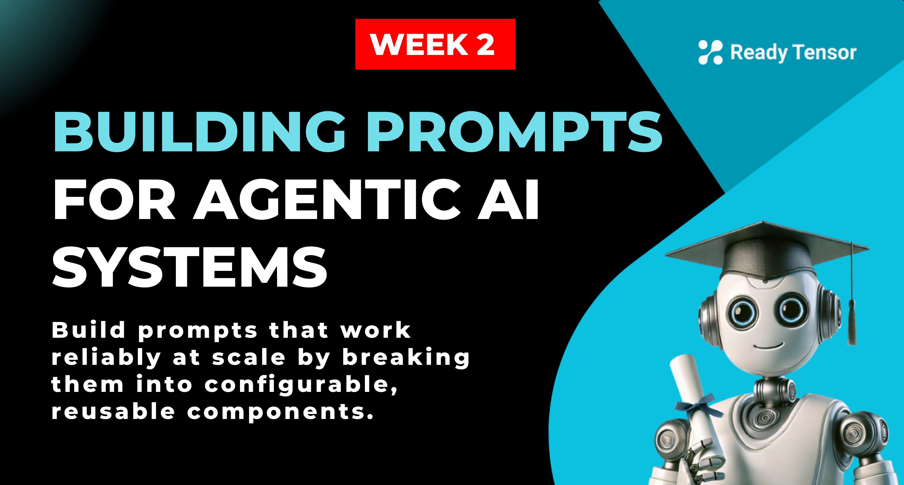
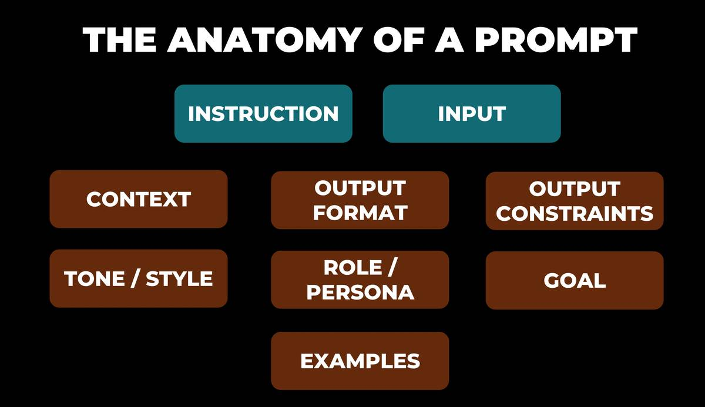
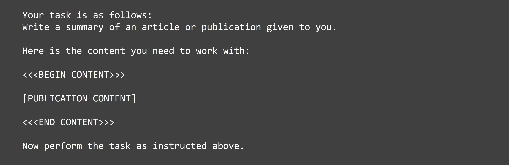
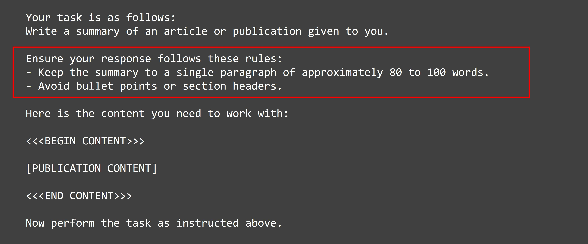
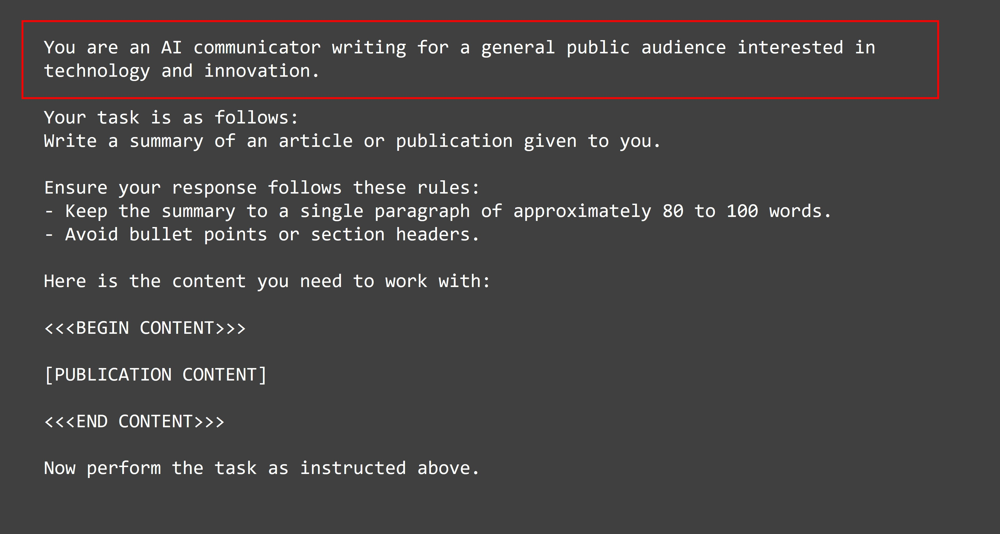

--DIVIDER--

---

[⬅️ Previous - Agents Vs. Workflows](https://app.readytensor.ai/publications/Xq3L2HSWLPou)
[➡️ Next - Advanced Reasoning Techniques](https://app.readytensor.ai/publications/3jI5t1hwF8wM)

---

--DIVIDER--

# TL;DR

In this lesson, you’ll learn how to design effective prompts by breaking them into modular components — like instruction, tone, role, and constraints — and assembling them with intention. We’ll walk through a real example, improving a summary prompt step by step to show how each element makes the output clearer, more consistent, and more useful for real-world AI applications.

--DIVIDER--

:::info{title="Code Repo and Video Walk-through"}
This lesson has a code repository attached and includes a code walkthrough video at the end. We recommend reading through the lesson first to understand the concepts, then watching the video walkthrough to see how the code repository implements these ideas in practice.
:::

--DIVIDER--

# Designing Prompts That Work

What’s the difference between asking your AI assistant “Summarize this article” and getting an output that’s actually clear, relevant, and fit for purpose?

The answer lies in moving beyond casual prompting and embracing a more structured, modular approach. In agentic AI systems, where prompts are delivered via code or APIs, every instruction needs to be explicit, repeatable, and aligned with the system’s goals.

This lesson helps you make that shift: from intuition-driven prompting to configurable, reliable prompt design — a foundation for building trustworthy and controllable AI behavior.

--DIVIDER--

# The Anatomy of a Prompt

Think of prompts as having modular components that you can mix and match depending on your needs. Some components are typically present in every prompt, others are optional but often game-changing.



**Core Components (usually required):**

- **Instruction**: What you want the AI to do
- **Input**: The data or content to work with

**Optional Components (but often game-changing):**

- **Context**: Background information that shapes the response
- **Output format**: How you want the result structured
- **Role/persona**: Who the AI should "act as"
- **Output constraints**: Limits on length, style, or content
- **Tone/style**: The voice and approach to use
- **Examples**: Samples of what good output looks like
- **Goal**: The underlying objective or purpose

The key insight? These components become your **prompt template**, a configurable system where you can adjust individual elements to fine-tune your results, rather than rewriting everything from scratch.

--DIVIDER--

# From Components to Real Prompts

Now that you’ve seen the key building blocks of a prompt, let’s see how they actually work in practice.

--DIVIDER--

## Prompt Walkthrough: One Task, Many Improvements

We'll focus on a single, practical task: summarizing a technical publication. Specifically, we'll use a real article published on Ready Tensor as the input. The goal is to generate a clear, useful summary - something that could be shared with peers, embedded in documentation, or published for a broader audience.

We'll start with a very simple prompt — just instruction and input. From there, we'll improve it using the modular components we just discussed, adding one piece at a time. At each step, you'll see how even small changes to the prompt structure can lead to clearer, more relevant, and more reliable responses.

:::info{title="INFO"}

 <h2>Before You Begin</h2>
 
 1. **Publication Used**: We'll be working with **"One Model, Five Superpowers: The Versatility of Variational Auto-Encoders"** which is available [here](https://app.readytensor.ai/publications/yzN0OCQT7hUS).
 
 2. **Code & Data**: Check the [GitHub repo](https://github.com/readytensor/rt-agentic-ai-cert-week2) for the implementation of these examples. It also contains the publication data.
 
 3. **Technical Setup**: All examples use `gpt-4o-mini` (release date 2024-07-18) with temperature set to 0, run through API calls (not chat interface).
 
 4. **API Calls**: The prompts in these examples are used in standalone API calls, not a chat window. That means there's no memory or prior context - each prompt must contain everything the model needs. If you're used to prompting in a chat interface, expect different behavior: API prompts are stateless and repeatable, which is exactly what you want when building reliable AI systems.
 
 5. **For Your Testing**: We're not inserting the full publication text in displayed prompts for brevity, but you should insert it in place of `[PUBLICATION CONTENT]` when conducting your own testing.
 
 :::
 
 Now, let's walk through our examples.
 
 ---

--DIVIDER--

## Example 1: The Baseline (Instruction + Input Only)

Let's start with the most basic approach - just an instruction and the content to work with.

**Our prompt:**



> _**Note**: For brevity, we're not inserting the full publication text in displayed prompts, but you should insert it in place of `[PUBLICATION CONTENT]` when conducting your own testing._

You might notice we're using lead-in phrases like "Your task is as follows:". This may seem unnecessary now, but it will become clear why as we start adding more prompt elements. These separators help create clear boundaries between different components for the LLM to parse effectively.

**The response we get:**

```txt
The article titled "One Model, Five Superpowers: The Versatility of Variational Autoencoders" explores the capabilities of Variational Autoencoders (VAEs), a significant model in deep learning and machine learning. VAEs are highlighted for their versatility in various applications, including data compression, noise reduction, synthetic data generation, anomaly detection, and missing data imputation, with practical demonstrations using the MNIST dataset of handwritten digits.

The publication begins by explaining the fundamental architecture of VAEs, which consists of an encoder that compresses input data into a probabilistic latent space and a decoder that reconstructs the original data from this compressed representation. The article emphasizes the advantages of VAEs over traditional autoencoders, particularly their ability to generate new data and handle complex distributions.

Key applications of VAEs are detailed, showcasing their effectiveness in:
1. **Data Compression**: VAEs can significantly reduce the dimensionality of data while preserving essential features, as demonstrated with MNIST images.
2. **Data Generation**: After training on the MNIST dataset, VAEs can generate new, similar digits by sampling from the latent space.
3. **Noise Reduction**: VAEs effectively reconstruct clean images from noisy inputs, enhancing data usability.
4. **Anomaly Detection**: By modeling normal data distributions, VAEs can identify outliers based on reconstruction loss.
5. **Missing Data Imputation**: VAEs can infer and reconstruct missing parts of data, making them suitable for handling incomplete datasets.

The article also compares VAEs with Generative Adversarial Networks (GANs), highlighting their respective strengths and weaknesses. VAEs are noted for their stability and versatility, making them suitable for tasks requiring both generation and reconstruction capabilities.

In conclusion, the publication encourages further exploration and experimentation with VAEs, emphasizing their transformative potential in various domains of research and industry. The article serves as a comprehensive guide for AI/ML practitioners looking to leverage VAEs in their work.
```

 <h3>What we got:</h3>
 The summary is decent for a first attempt with a pretty basic prompt. It's factually accurate and covers the key points of the publication.
 
 <h3>The problem:</h3>
 It's way too lengthy for our purpose. The response is over 250 words and spans multiple paragraphs with bullet points. If we want something concise - say, one paragraph of about 80-100 words - we need to be more specific about our requirements.
 
 This leads us to our first improvement: adding **output constraints**.
 
 ---

--DIVIDER--

## Example 2: Adding Output Constraints

Now let's address the length issue by adding **output constraints** to our prompt. We'll specify exactly what format and length we want.

**Our updated prompt:**



> _**Note:** The red box highlights the new output constraints section we've added to control the format and length of the response._

**The response we get:**

```txt
The article "One Model, Five Superpowers: The Versatility of Variational Autoencoders" explores the multifaceted applications of Variational Autoencoders (VAEs) in deep learning, particularly using the MNIST dataset. It highlights five key capabilities: data compression, synthetic data generation, noise reduction, anomaly detection, and missing data imputation. The publication details the architecture of VAEs, emphasizing their probabilistic encoding and generative abilities, which distinguish them from traditional autoencoders. By providing practical examples and implementation insights in PyTorch, the article encourages AI/ML practitioners to leverage VAEs for diverse machine learning challenges, showcasing their transformative potential across various domains.
```

 <h3>This is much better!</h3>
 The LLM definitely addressed what we asked for - we got a single paragraph that's about 95 words, with no bullet points or headers. The constraints worked exactly as intended.
 
 <h3>The remaining issue</h3>
 While the length and general format is now correct, the language feels quite formal and academic. Notice phrases like "multifaceted applications," "transformative potential," and "diverse machine learning challenges." If this summary is intended for a broader audience, we need to consider both who is writing this and who it's for.  <br>  <br> 
 
 This leads us to our next improvement: adding a **role or persona** to establish who the AI should embody as the writer and who the intended audience is, which will guide both the messaging and communication style.
 
 ---

--DIVIDER--

## Example 3: Adding a Role/Persona

Now let's address the messaging and communication style issue by adding a role or persona to guide how the AI should communicate.

**Our updated prompt:**



_The red box highlights the new **role** section that establishes who the AI should act as when writing the summary._

**The response we get:**

```
The article discusses Variational Autoencoders (VAEs), which are flexible models used in machine learning for various tasks. VAEs can compress data, generate new data, reduce noise, detect anomalies, and fill in missing data. The publication uses the MNIST dataset of handwritten digits to illustrate these applications. It explains how VAEs work, including their unique probabilistic approach, and compares them to traditional autoencoders. The article encourages further exploration of VAEs, emphasizing their potential in both research and practical applications across different fields.
```

 <h3>Great improvement!</h3>
 The language is noticeably more accessible. Gone are the overly formal phrases like "multifaceted applications" and "transformative potential." Instead, we get clearer language like "flexible models" and "various tasks." The role guidance successfully shifted the writing toward a general audience.
 
 <h3>What's still missing:</h3>
 While the communication approach is better, the writing still feels somewhat generic and polished in a way that doesn't quite feel human or personal. The language, while clearer, still has that "AI-generated" quality with phrases that feel a bit stiff or overly neutral.
 
 This brings us to our next refinement: adding specific **style and tone guidelines** to create a more natural, engaging voice.
 
 ---

--DIVIDER--

## Example 4: Adding Style and Tone Guidelines

Now let's refine the voice further by adding specific **style and tone guidelines** to create more natural, engaging communication.

**Our updated prompt:**


_The red box highlights the new **style and tone guidelines** section that provides detailed instructions on how to write._

**The response we get:**

```
The article discusses Variational Autoencoders (VAEs), which are flexible deep learning models used for various tasks like data compression, noise reduction, data generation, anomaly detection, and missing data imputation. It explains how VAEs work by encoding data into a compressed format and then decoding it back, using the MNIST dataset of handwritten digits as a practical example. The publication emphasizes the advantages of VAEs over traditional methods, particularly their ability to generate new data and handle complex distributions. It encourages further exploration and experimentation with VAEs in different fields, highlighting their broad applicability in machine learning.
```

 <h3>What changed:</h3>
 In this short paragraph, the differences may not be immediately perceptible compared to the previous version. However, these style guidelines matter significantly when processing large volumes of requests - they help ensure consistency and prevent the AI from slipping into overly promotional or buzzword-heavy language that sometimes creep in.
 
 <h3>The remaining gap:</h3>
 
 While we've improved the format, tone, and style, we haven't been explicit about the _purpose_ of this summary. Are we trying to help someone decide whether to read the full article? Are we creating a reference for documentation? The intended outcome shapes how we prioritize and present information.
 
 Let’s wrap it up by adding the final component: a clear goal to align the summary with its purpose.
 
 ---

--DIVIDER--

## Example 5: Adding a Clear Goal

Finally, let's add a **goal** to make the summary's purpose explicit and guide how information should be prioritized.

**Our updated prompt:**


_The red box highlights the new **goal** section that defines the specific outcome we want to achieve._

**The response we get:**

```
The article discusses Variational Autoencoders (VAEs), a type of deep learning model known for their flexibility in handling various tasks. It highlights five main applications: data compression, data generation, noise reduction, anomaly detection, and missing data imputation, using the MNIST dataset of handwritten digits as a practical example. The publication explains how VAEs work, including their unique probabilistic approach, and provides insights into their implementation in PyTorch. It also compares VAEs with traditional autoencoders and GANs, emphasizing their advantages in stability and versatility. This resource is valuable for anyone interested in understanding and applying VAEs in machine learning.
```

 <h3>Putting It All Together</h3>
 Notice how the summary now ends with an explicit recommendation about the publication's value. The goal guidance shifted the focus toward helping someone make a decision about whether to invest time reading the full article.

--DIVIDER--

## The Power of Prompt Modularization:

Each enhancement we made corresponds to a specific prompt component. Here’s a quick summary of what we added, why it matters, and when it showed up:

| Component              | Purpose                                     | Introduced In |
| ---------------------- | ------------------------------------------- | ------------- |
| **Instruction**        | Defines the task for the AI                 | Example 1     |
| **Output Constraints** | Controls format, length, or structure       | Example 2     |
| **Role/Persona**       | Sets the voice and audience perspective     | Example 3     |
| **Style & Tone**       | Guides how the AI communicates              | Example 4     |
| **Goal**               | Aligns the output with the intended purpose | Example 5     |

This modular approach gives you **granular control** over each aspect of the AI's behavior, and just as importantly, it makes your prompts **configurable and reusable**. Instead of hard-coding every new prompt, you can mix and match components depending on the task, audience, or context.

Want a different tone? Swap in a new style guideline. Need a different format? Adjust the constraints or add output formatting instructions. Want to shift the intent of the output? Just update the goal — no need to rewrite the entire prompt.

You’re not crafting one-off prompts; you’re building a **scalable system** — a prompt design library you can plug into any future Agentic AI project. This lesson covered just a few components, but others, like context blocks, examples, and response format specs, fit naturally into the same approach. Together, they form a flexible, powerful foundation for scalable AI development.

--DIVIDER--

# 🎥 See It in Action: Code Demo & Real Examples

Ready to see this modular approach actually work? This video walks you through the complete implementation — the prompt builder code, YAML configurations, and live examples including our publication summarization task and a LinkedIn post generator.

You'll watch the system build prompts piece by piece, see the actual LLM responses, and understand how swapping a single configuration line can completely change the output. It's one thing to read about modular prompts; it's another to see them constructed in real-time.

:::youtube[Title]{#yeC66lAMbyQ}

This bridges everything from the lesson into working code you can actually use. All the code and examples are in the [GitHub repository](https://github.com/readytensor/rt-agentic-ai-cert-week2). Clone it and experiment with your own prompts.

--DIVIDER--

# Conclusion

We've walked through transforming a basic prompt into a sophisticated, multi-component system by systematically adding instruction, constraints, role, style guidelines, and goals. This modular approach creates reusable, configurable prompts that give you precise control over Agentic AI behavior. While we focused on the prompt structure here, imagine the possibilities when this logic isn't hard-coded but driven dynamically through configuration - that's exactly what we'll explore in upcoming lessons.

--DIVIDER--

---

[⬅️ Previous - Agents Vs. Workflows](https://app.readytensor.ai/publications/Xq3L2HSWLPou)
[➡️ Next - Advanced Reasoning Techniques](https://app.readytensor.ai/publications/3jI5t1hwF8wM)

---
