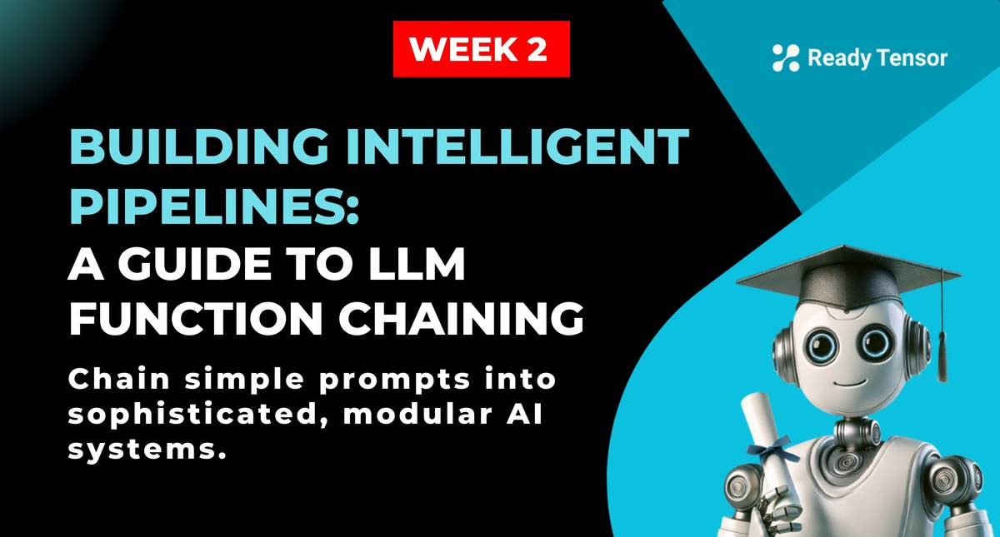
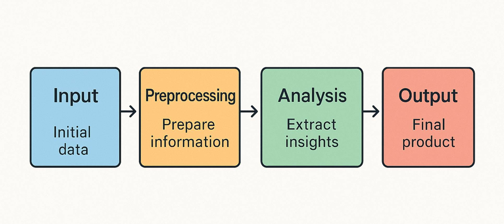
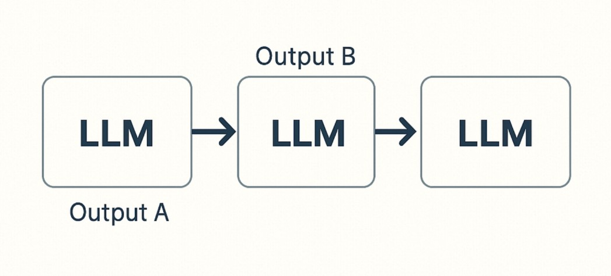

--DIVIDER--

---

[⬅️ Previous - Output Structuring](https://app.readytensor.ai/publications/LHMxs5Dtsv26)
[➡️ Next - Intro to Vector DBs](https://app.readytensor.ai/publications/Zdrul0fG17Mg)

---

--DIVIDER--

# TL;DR

Function chaining is a foundational concept for building robust, modular, and intelligent AI systems. Rather than relying on a single, monolithic prompt or function, chaining allows you to break down complex operations into smaller, manageable steps, each with a focused responsibility. This approach not only enhances clarity and maintainability but also unlocks new levels of flexibility and power in your AI applications

--DIVIDER--

# Direct Prompting vs Chaining



At its simplest, interacting with a language model can be as straightforward as sending a direct prompt and receiving a response as you have already explored in our previous lecture contents. However, as soon as your use case demands more structure, like reusability, dynamic input handling, or multi-stage reasoning, direct prompting quickly hits its limits.

Prompt templates step in as the next evolution, letting you define dynamic, reusable prompt structures. Templates separate static instructions from dynamic content, making your code more consistent and easier to maintain. But even templates have their boundaries: they’re great for single interactions, but not enough for workflows that require multiple, dependent steps.

--DIVIDER--

# Direct Prompting: The Simplest Approach

Before diving into complex function chains take a quick recap on our lesson, let's start with the simplest possible interaction with an LLM - direct prompting. This approach requires minimal setup and is perfect for quick experimentation or simple use cases.

```python
from langchain_openai import ChatOpenAI
from dotenv import load_dotenv

# Load environment variables (essential to not expose your API key while deploying)
load_dotenv()

# Initialize the model
model = ChatOpenAI()

# Send a simple prompt directly to the model
response = model.invoke("What is 2+2 ?")

# Print the response
print(response.content)
```

Output:

````
2 + 2 equals 4.
```

--DIVIDER--

:::info{title="When to Use Direct Prompting"}

Direct prompting is ideal for situations that require quick prototyping, simple one-off queries, or when there is no need to reuse the same prompt structure or incorporate dynamic input variables. This approach involves giving clear, explicit instructions to the AI, which helps minimize ambiguity and typically produces predictable and relevant responses. While direct prompting is straightforward and efficient for specific tasks, it lacks the flexibility and reusability offered by more structured, template-based prompting methods. As applications become more complex, transitioning to template-based prompting is advisable to better handle dynamic inputs and repeated use cases.
:::

--DIVIDER--

# Templates: Dynamic Input Insertion

Prompt templates are an essential concept that bridges simple direct prompts and more complex function chains. A template allows you to define a prompt structure once and then reuse it with different inputs.


```python
from langchain_core.prompts import PromptTemplate
from langchain_openai import ChatOpenAI
from dotenv import load_dotenv

load_dotenv()

# Create a prompt template with placeholders
template = PromptTemplate(
    input_variables=["country"],
    template="What is the capital of: {country}?"
)

# Create a model
model = ChatOpenAI(temperature=0)

for country in ['France', 'Spain', 'Germany']:
    formatted_prompt = template.format(country=country)
    print("Formatted prompt:", formatted_prompt)

    response = model.invoke(formatted_prompt)
    print("\nResponse:", response.content, '\n----------------')

````

Output:

```
Formatted prompt: What is the capital of: France?

Response: Paris
----------------
Formatted prompt: What is the capital of: Spain?

Response: Madrid
----------------
Formatted prompt: What is the capital of: Germany?

Response: Berlin
----------------
```

# Why Use Templates?

Templates offer clear advantages over direct prompting. They ensure consistency by keeping the same structure and instructions across prompts. You can reuse a template multiple times with different inputs, making updates easier since changes are made in one place. Templates also separate fixed instructions from variable content, improving clarity and making it simpler to test different inputs. Overall, templates help build modular, reusable components that support more complex function chaining.

By using templates, you're taking the first step toward modular, reusable components that can be composed into more complex chains - the foundation of function chaining.

--DIVIDER--

:::tip{title="Prompt Templates Are Critical in Production"}

Using prompt templates is a smart way to make your AI workflows more flexible and reusable. Instead of writing new prompts from scratch every time, you can create a template with variables that adapt to different inputs. This helps keep your prompts consistent and easy to manage. When you move to production, this becomes even more important because prompts usually need to handle all kinds of changing information, like user input, data from other systems, dynamic states, or different user settings. Without templates, you might end up juggling messy string concatenations or multiple versions of similar prompts, which can get confusing and hard to maintain. By relying on templates, you make your code cleaner, easier to test, and ready to handle whatever comes its way.

:::

--DIVIDER--

## Creating Robust Templates for Dynamic Inputs

A strong prompt template separates fixed instructions from dynamic inputs, handles errors like missing or incorrect data, and keeps formatting consistent across variations. Clear documentation on expected inputs also helps ensure the template is used correctly.

Example of a template designed for production use:

```python
from langchain_core.prompts import PromptTemplate

customer_support_template = PromptTemplate(
    input_variables=["customer_name", "product_name", "issue_description", "previous_interactions", "tone"],
    template="""
    You are a customer support specialist for {product_name}.

    Customer: {customer_name}
    Issue: {issue_description}
    Previous interactions: {previous_interactions}

    Respond to the customer in a {tone} tone. If you don't have enough information to resolve their issue,
    ask clarifying questions. Always prioritize customer satisfaction and accurate information.
    """
)

# This can now handle all types of customer inquiries with appropriate context
response = customer_support_chain.invoke({
    "customer_name": "Alex Smith",
    "product_name": "SmartHome Hub",
    "issue_description": "Device won't connect to WiFi after power outage",
    "previous_interactions": "Customer has already tried resetting the device twice.",
    "tone": "empathetic but technical"
})
```

Now that we understand how to create dynamic, reusable templates, we can explore how to connect these components together to build more sophisticated AI workflows through ** function chaining **.

--DIVIDER--

# How does function chaining actually works ?

Function chaining connects multiple AI-powered operations in sequence, where the output of one step becomes the input for the next. This mirrors how complex tasks are handled in real-world systems: each stage specializes in a subtask, passing its results along the chain for further processing.

Key benefits of function chaining include:

- Breaks down complex tasks into smaller, more manageable and understandable components.
- Allows prompts to specialize and focus on specific subtasks for better accuracy.
- Makes debugging easier by isolating errors within individual steps or components.
- Ensures output formatting is consistent and reliable across all stages.

## Sequential Chains: Output-to-Input Composition

The most basic form of function chaining is a sequential chain, where operations happen in a linear order:

1.  First LLM call generates output A
2.  Output A becomes input to second LLM call, generating output B
3.  Output B becomes input to third LLM call, and so on



This pattern is particularly useful for multi-stage reasoning tasks, such as:

- Research → Analysis → Recommendation
- Data extraction → Transformation → Summarization
- Question analysis → Research → Answer formulation

## LangChain Runnables

[LangChain](https://www.langchain.com/) provides excellent abstractions for implementing function chains with its Runnables API:

### Prompt + Model as Runnable

[LangChain's Runnables Interface](https://python.langchain.com/docs/concepts/runnables/) allows for composable chains using a functional programming style:

```python
from langchain_core.prompts import PromptTemplate
from langchain_openai import ChatOpenAI
from dotenv import load_dotenv

load_dotenv()

# Create a prompt template
prompt = PromptTemplate(
    input_variables=["topic"],
    template="Generate 3 questions about {topic}:"
)

# Create an LLM
llm = ChatOpenAI(temperature=0)

# Create a chain by binding the prompt to the model
question_chain = prompt | llm

# Invoke the chain
questions = question_chain.invoke({"topic": "artificial intelligence"})
```

Output:

```
1. How is artificial intelligence being used in various industries to improve efficiency and productivity?
2. What ethical considerations need to be addressed when developing and implementing artificial intelligence technologies?
3. How can we ensure that artificial intelligence systems are transparent and accountable in their decision-making processes?
```

## Chaining Runnables with Pipe Operator

The Runnables API makes sequential chaining intuitive with the pipe (`|`) operator:

```python
from langchain_core.prompts import PromptTemplate
from langchain_openai import ChatOpenAI
from langchain_core.output_parsers import StrOutputParser
from dotenv import load_dotenv

load_dotenv()

# First chain generates questions
question_prompt = PromptTemplate(
    input_variables=["topic"],
    template="Generate 3 questions about {topic}:"
)

# Second chain generates answers based on questions
answer_prompt = PromptTemplate(
    input_variables=["questions"],
    template="Answer the following questions:\n{questions}\n You response should contain the question and the answer to it."
)

# Create the model
llm = ChatOpenAI(temperature=0.0)

# Output parser to convert model output to string
output_parser = StrOutputParser()

# Build the question generation chain
question_chain = question_prompt | llm | output_parser

# Build the answer generation chain
answer_chain = answer_prompt | llm | output_parser

# Define a function to create the combined input for the answer chain
def create_answer_input(output):
    return {"questions": output}

# Chain everything together
qa_chain = question_chain | create_answer_input | answer_chain

# Run the chain
result = qa_chain.invoke({"topic": "artificial intelligence"})
print(result)
```

Output:

````
1. How is artificial intelligence being used in various industries to improve efficiency and productivity?
Artificial intelligence is being used in various industries to automate repetitive tasks, analyze large amounts of data quickly and accurately, optimize processes, and make predictions based on patterns and trends. This helps improve efficiency and productivity by reducing human error, saving time, and enabling businesses to make data-driven decisions.

2. What are the ethical implications of using artificial intelligence in decision-making processes, such as in healthcare or criminal justice?
The use of artificial intelligence in decision-making processes raises ethical concerns related to bias, accountability, transparency, and privacy. AI algorithms can perpetuate existing biases in data, leading to unfair outcomes. There is also a lack of transparency in how AI systems make decisions, which can make it difficult to hold them accountable. Additionally, the use of AI in healthcare and criminal justice raises concerns about privacy and the potential for misuse of sensitive data.

3. How can we ensure that artificial intelligence systems are developed and implemented in a way that prioritizes transparency, accountability, and fairness?
To ensure that artificial intelligence systems prioritize transparency, accountability, and fairness, developers and organizations should prioritize ethical considerations throughout the entire development process. This includes ensuring that data used to train AI models is representative and unbiased, making AI algorithms explainable and interpretable, implementing mechanisms for auditing and monitoring AI systems, and involving diverse stakeholders in the decision-making process. Additionally, regulatory frameworks and guidelines can help ensure that AI systems are developed and implemented in a way that aligns with ethical principles.
```

--DIVIDER--

---
# 🎥 Visual Walkthrough

:::youtube[AAIDC WK2 L3: A Guide to LLM Function Chaining]{#BxgjyY_qasE}

---

--DIVIDER--

# Conclusion

By breaking down tasks, specializing each step, and connecting them thoughtfully, you create workflows that are not only easier to build and maintain, but also more adaptable to future needs. This modular approach is the foundation for advanced applications, from semantic search to agentic AI, where reasoning, retrieval, and generation are orchestrated in a seamless, intelligent pipeline.

--DIVIDER--

---

[⬅️ Previous - Output Structuring](https://app.readytensor.ai/publications/LHMxs5Dtsv26)
[➡️ Next - Intro to Vector DBs](https://app.readytensor.ai/publications/Zdrul0fG17Mg)

---
````
