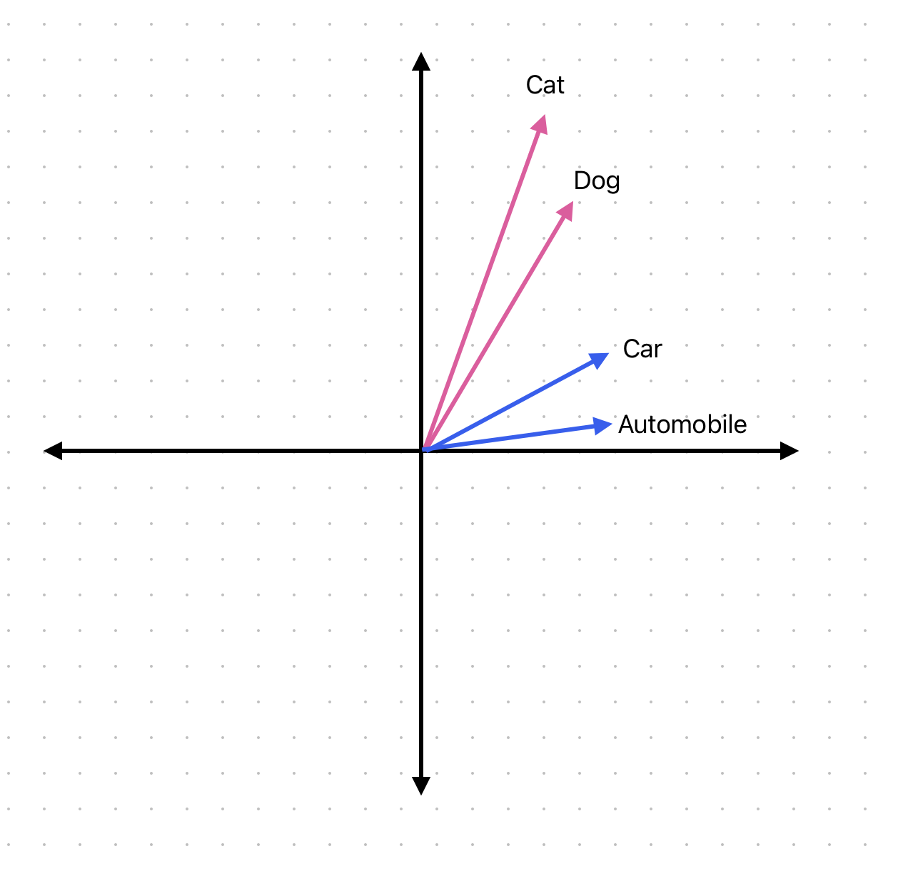

--DIVIDER--

---

[⬅️ Previous - Function Chaining](https://app.readytensor.ai/publications/X51gr9ZwohcW)
[➡️ Next - Vector Databases Implementation](https://app.readytensor.ai/publications/hwjIdxHZGASQ)

---

--DIVIDER--

# TL;DR

This lesson introduces the retrieval challenge at the heart of intelligent AI systems. You'll learn how vector databases solve this challenge by enabling search based on meaning, not just exact words. You'll understand how embeddings convert language into math and how that unlocks semantic understanding for the agentic AI systems you'll build.

:::info{title="Already Know Vector DBs?"}
If you're already familiar with vector databases and embeddings concepts, you can skip directly to [Lesson 3B: Building a Semantic Retrieval System](https://app.readytensor.ai/publications/hwjIdxHZGASQ), which covers hands-on implementation and includes a video with practical production insights from Ready Tensor's engineering team.

:::

---

--DIVIDER--

# The Search Problem Every AI Builder Faces

Imagine you're building an AI assistant for a data science team's knowledge base. The system needs to find the right documents, not just ones that contain matching words, but ones that are genuinely helpful. Now imagine a data scientist asks, "How do I handle missing values in my dataset?" You've got a document titled "Strategies for Dealing with Incomplete Data Records." It's exactly what they need but keyword search won't find it. There's no overlap in the phrasing.

This isn't a small inconvenience. It's the core retrieval problem for AI systems: how do you retrieve content that's semantically relevant, not just textually similar?

--DIVIDER--

# A Real Challenge at Ready Tensor

This exact problem shaped how we built the Ready Tensor platform. Users needed to search for AI publications, but the way they searched didn't always match how authors described their work. One user might search for "neural network tutorials," but the relevant articles might be titled "Deep Learning Fundamentals" or "Multi-Layer Perceptron Explained."

Keyword matching wasn't just inadequate - it was actively misleading. We needed something smarter: a way for the system to connect concepts, even when they were expressed in completely different words.

--DIVIDER--

# Why Keywords Fail

Let's take a machine learning example. A user asks, "How do I prevent overfitting?" In your knowledge base, you've got three excellent documents:

- One about regularization techniques
- Another focused on cross-validation
- A third discussing dropout and early stopping

All of them are about overfitting, but none use that exact term. If your system relies on keyword search, it misses all three. That's because keyword search depends on exact matches. It can't recognize that "overfitting," "poor generalization," and "memorization" are all different expressions of the same idea.

Human readers make these connections instantly. Traditional search systems do not.

--DIVIDER--

# The Shift: From Tokens to Meaning

This is where vector databases come in. Instead of comparing words, they compare ideas mathematically. Every piece of text is converted into a numerical representation called an embedding. These embeddings are vectors, meaning they live in a high-dimensional space. In this space, similar meanings are physically close together even if the original words are completely different.

A search query like "How do I prevent overfitting?" becomes a vector. The system doesn't look for the phrase "prevent overfitting." It looks for vectors nearby in meaning which might correspond to content about regularization, generalization, or cross-validation.

Suddenly, your AI system can retrieve relevant information based on intent, not phrasing. It no longer needs users to guess the right keywords. It just needs to understand the question.

--DIVIDER--

# What is an Embedding?

At its most basic level, an embedding is an array of numbers (a vector) that represents a piece of data in a high-dimensional space. Each dimension in this vector captures some aspect of the data's meaning or properties. The key insight is that similar or related items will have similar embedding vectors - they'll be positioned close to each other in this vector space.

**For example:**

If we create embeddings for these words:

- "cat" → [0.2, 0.8, 0.1, 0.5, ...]
- "dog" → [0.3, 0.7, 0.2, 0.4, ...]
- "car" → [0.9, 0.1, 0.8, 0.2, ...]

The vectors for "cat" and "dog" would be much more similar to each other than either would be to "car" because they share semantic relationships (both are animals and pets).

The beauty of embeddings is that they give us a way to turn fuzzy, flexible human language into something structured and machine-readable without losing its meaning.

--DIVIDER--

# Why This Changes Everything for Retrieval

With embeddings, we can finally search the way people think. When someone searches for "deep learning," we don't just look for that phrase. We also consider "neural networks," "CNNs," "transformers," and other related terms because they're nearby in vector space.

This is especially powerful in AI, where the same concept might be described in radically different ways depending on the context. Researchers, engineers, and business users might all talk about the same idea using different language. A system based on embeddings can bridge that gap.

This approach now powers everything from semantic search engines and recommendation systems to the intelligent retrieval systems that make agentic AI applications possible.

--DIVIDER--

# The Foundation for Intelligent AI

Vector databases will be the backbone of every agentic AI system you build in this program. Whether you're creating systems that retrieve relevant documents, recommend similar content, or ground AI responses in factual knowledge, it all starts with the ability to understand meaning mathematically.

The quality of your embeddings and the effectiveness of your vector database directly determine whether your AI system finds the right information or fails silently. This isn't just about search, it's about giving AI systems the ability to work with human knowledge intelligently.

--DIVIDER--

# Up Next: Build One Yourself

In the next lesson, we'll move from concept to code. You'll set up your own embedding model, store documents in a vector database, and run semantic search queries. We'll also cover best practices like chunking, metadata, and choosing between different vector database solutions.

You now understand why vector databases matter. Next, you'll learn how to build one.

--DIVIDER--

---

[⬅️ Previous - Function Chaining](https://app.readytensor.ai/publications/X51gr9ZwohcW)
[➡️ Next - Vector Databases Implementation](https://app.readytensor.ai/publications/hwjIdxHZGASQ)

---
