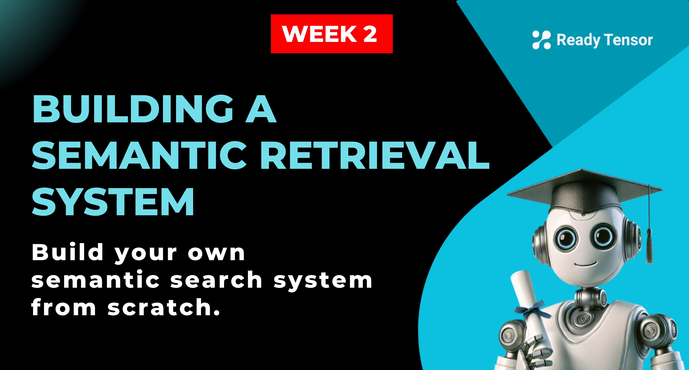

--DIVIDER--

---

[⬅️ Previous - Vector DBs - How AI Finds Meaning](https://app.readytensor.ai/publications/Zdrul0fG17Mg)
[➡️ Next - Intro to RAG](https://app.readytensor.ai/publications/3Ht58iNXuvS7)

---

--DIVIDER--

# TL;DR

In this hands-on lesson, you'll implement a complete vector database pipeline using real documents, embedding models, and ChromaDB. You'll learn how to chunk documents intelligently, store them as searchable vectors, and run semantic queries. This is the exact workflow that powers retrieval systems and will become the foundation for your agentic AI projects.

--DIVIDER--

:::info{title="Note"}

 <h2>📹 Implementation Video Included</h2>
 
 This lesson includes a detailed implementation video at the end where Ready Tensor's ML engineer walks through real production decisions, from choosing PgVector over Pinecone to optimizing embedding models for AI content. We recommend working through the hands-on examples first to understand the vector database pipeline, then watching the video to see how these decisions play out in a live production system.
 :::
 
---

--DIVIDER--

# From Concept to Code

Last time, we explored why traditional search fails and how vector databases use embeddings to search by meaning. Now, it's time to put that into practice. You’ll build a retrieval system that can store and search documents using semantic similarity.

We’ll use [ChromaDB](https://www.trychroma.com/) for the vector store, and a Hugging Face embedding model (`all-MiniLM-L6-v2`) to generate the vectors. These tools are fast, open-source, and production-ready - perfect for your first vector pipeline.

---

--DIVIDER--

# Step 1: Choose an Embedding Model

To get started, we need a model that turns text into vector embeddings. LangChain makes it easy to load popular models like this:

```python
from langchain_community.embeddings import HuggingFaceEmbeddings

embeddings = HuggingFaceEmbeddings(model_name="all-MiniLM-L6-v2")
```

The model you choose controls how meaning is captured. Some models are better for short-form answers, others for technical documents, and some for multilingual tasks. For this lesson, we’re keeping it simple, but in production, model choice can make a big difference.

---

--DIVIDER--

# Step 2: Prepare the Documents

Let’s define some example content. In a real system, these would be loaded from files, but we’ll keep it simple to start:

```python
from langchain_core.documents import Document

texts = [
    "Vector databases enable semantic search by storing embeddings.",
    "RAG systems combine retrieval with language model generation.",
    "Embeddings capture semantic meaning in numerical form."
]

metadatas = [
    {"topic": "databases", "type": "technical"},
    {"topic": "AI", "type": "technical"},
    {"topic": "ML", "type": "technical"}
]

documents = [
    Document(page_content=text, metadata=metadatas[i])
    for i, text in enumerate(texts)
]
```

Notice how each document also has metadata. This becomes essential when you want to filter or organize your content later.

---

--DIVIDER--

# Step 3: Create the Vector Store

Now we pass the documents and embeddings to Chroma. It takes care of storing vectors and setting up a similarity index.

```python
from langchain_community.vectorstores import Chroma

vectorstore = Chroma.from_documents(documents, embeddings)
```

Chroma is embedded and easy to use. Other vector databases like Pinecone, Weaviate, or Qdrant work similarly, you just change the backend.

---

--DIVIDER--

# Step 4: Search by Meaning

With everything set up, you can now perform semantic search:

```python
results = vectorstore.similarity_search_with_score("What is a RAG system?", k=2)

for doc, score in results:
    print(f"Score: {score:.3f}")
    print(f"Text: {doc.page_content}")
    print(f"Metadata: {doc.metadata}")
    print("---")
```

Output:

```
Score: 0.495
Text: RAG systems combine retrieval with language model generation.
Metadata: {'topic': 'AI', 'type': 'technical'}
---
Score: 0.938
Text: Embeddings capture semantic meaning in numerical form.
Metadata: {'topic': 'ML', 'type': 'technical'}
```

The system finds conceptually similar content regardless of exact word matches. Lower scores indicate higher similarity. So, 0.495 is more relevant than 0.938.

:::info{title="Info"}
In the last example, our search query was "What is a RAG system?". You can see that the most relevant document was indeed about RAG. The lower the score the more relevant the document is. This is because we are using cosine similarity as a similarity metric here.

Note that the same functionality can be implemented without langchain. It can be done directly using the chromadb package, which gives you more control over the process. The choice of which package to choose depends on your use case.
:::

---

--DIVIDER--

# Going Beyond Toy Examples: Real Documents

Working with full-length articles or technical reports adds complexity. You can’t embed an entire 20-page document as one vector - it loses granularity and exceeds model limits. Instead, you **split documents into smaller chunks** before embedding them.

--DIVIDER--

# Why Chunk Size Matters

Most embedding models handle 512 to 2048 tokens, but shorter chunks often perform better for retrieval. Think about it: when someone asks a specific question, you want to return the relevant paragraph, not the entire document.

Chunks of 300-800 tokens typically work well. They're long enough to preserve context but short enough to maintain focus on specific topics.

--DIVIDER--

# How to Split Text Intelligently

LangChain provides a `RecursiveCharacterTextSplitter` utility that breaks text at natural boundaries:

```python
from langchain.text_splitter import RecursiveCharacterTextSplitter

splitter = RecursiveCharacterTextSplitter(
    chunk_size=500,
    chunk_overlap=50
)

chunks = splitter.split_text(long_text)
```

The `chunk_overlap` ensures that important information at chunk boundaries isn’t lost. You don’t want a definition or code block cut in half.

---

--DIVIDER--

# Complete Document Processing Pipeline

Here's how to process a real document file:

```python
def process_document_file(file_path):
    # Read the document
    with open(file_path, 'r', encoding='utf-8') as f:
        text = f.read()

    # Split intelligently
    splitter = RecursiveCharacterTextSplitter(
        chunk_size=500,
        chunk_overlap=50
    )
    chunks = splitter.split_text(text)

    # Create documents with metadata
    documents = [
        Document(
            page_content=chunk,
            metadata={"source": file_path, "chunk_id": i}
        )
        for i, chunk in enumerate(chunks)
    ]

    # Create searchable vector store
    embeddings = HuggingFaceEmbeddings(model_name="all-MiniLM-L6-v2")
    vectorstore = Chroma.from_documents(documents, embeddings)

    return vectorstore
```

This pipeline transforms any text file into a searchable knowledge base. Users can now ask natural language questions and get relevant chunks back, regardless of the exact words they use.

---

--DIVIDER--

# What About Performance and Persistence?

In-memory databases like FAISS or temporary Chroma instances are great for prototyping. But for production, you’ll likely want persistent storage that survives restarts and scales across machines. Many vector DBs support both modes. For example, Chroma, Qdrant, Weaviate, and others offer disk-backed or distributed configurations.

You’ll also need to think about update strategies. If you add new documents, do you re-embed everything? Can your DB support real-time updates? What happens if your embedding model changes?

There are no universal answers, just trade-offs. But now you know how the pieces work, and what questions to ask.

--DIVIDER--

# 🎥 See It in Action: Real Implementation Decisions

Ready to see how these considerations play out in a production system? Our video walks you through Ready Tensor's complete vector database implementation, from evaluating PgVector versus Pinecone, to selecting embedding models, to optimizing chunking strategies for AI publication content.

You'll see the actual decision-making process behind choosing open-source versus API-based embeddings, performance comparisons between similarity metrics, and how scaling requirements shaped their final architecture.

:::youtube[Title]{#drwVELP7UuE}

--DIVIDER--

# Why This Matters for Agentic AI

This system becomes the foundation for retrieval-based reasoning. Whenever an AI agent needs external knowledge, this is the pipeline that gets it.

You’re not just matching keywords. You’re mapping meaning - translating fuzzy, natural questions into precise, relevant context that your language model can reason over. It’s the difference between static, reactive systems and dynamic, intelligent ones.

This is the memory layer of agentic AI. Get it right, and everything you build on top becomes smarter, more reliable, and more useful.

--DIVIDER--

# Conclusion

You've just built a complete semantic retrieval system from scratch. You understand how to convert documents into searchable embeddings, how chunking strategies affect retrieval quality, and what considerations matter for production deployments.

**The foundation is built:** This pipeline becomes the memory layer for every agentic AI system you'll create. The quality of your retrieval directly determines how intelligently your AI agents can access and use knowledge.

**Something to explore:** Experiment with different chunk sizes and embedding models using your own documents. Notice how these choices affect both relevance and specificity of search results.

--DIVIDER--

---

[⬅️ Previous - Vector DBs - How AI Finds Meaning](https://app.readytensor.ai/publications/Zdrul0fG17Mg)
[➡️ Next - Intro to RAG](https://app.readytensor.ai/publications/3Ht58iNXuvS7)

---
