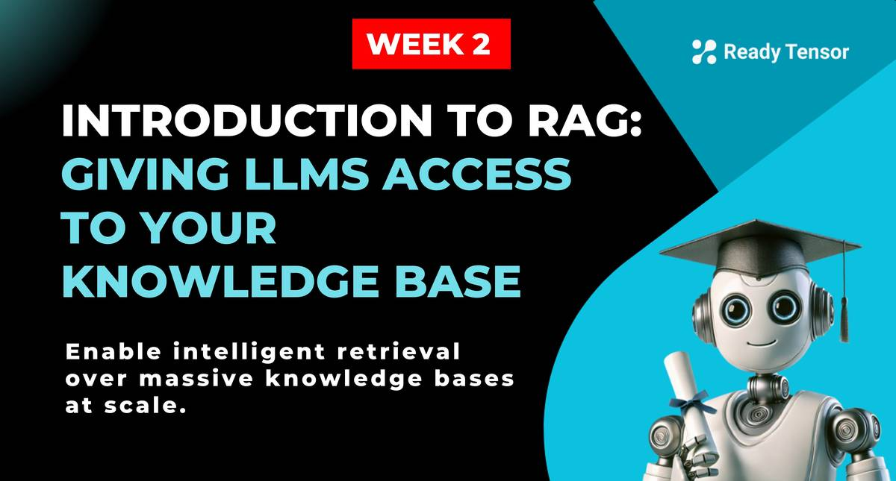
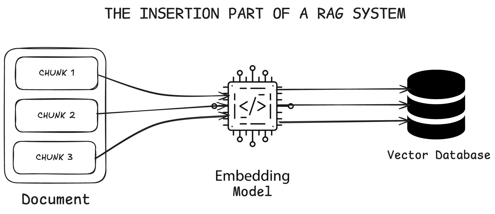
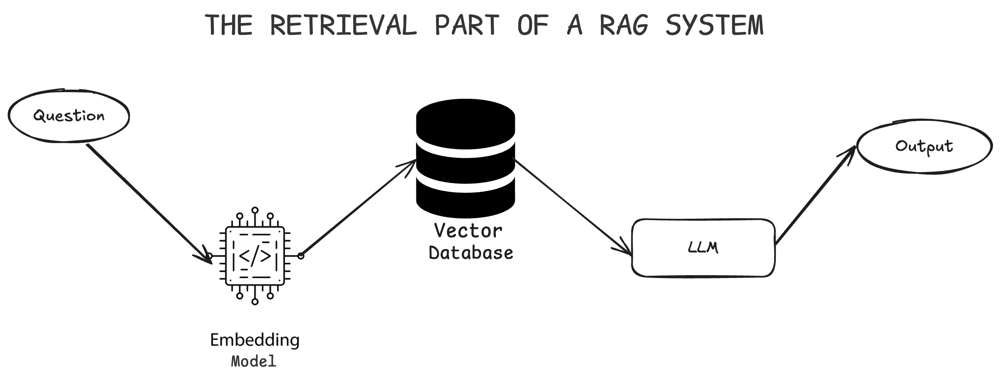

--DIVIDER--

---

[⬅️ Previous - Vector Databases Implementation](https://app.readytensor.ai/publications/hwjIdxHZGASQ)
[➡️ Next - Week 3 Preview](https://app.readytensor.ai/publications/gleIJzLtXA3m)

---

--DIVIDER--

# TL;DR

LLMs can't answer questions about your specific data - they only know what they learned during training. RAG (Retrieval Augmented Generation) solves this by finding relevant information from your knowledge base and including it in prompts. You'll learn why RAG beats expensive fine-tuning, understand its two-phase process (build searchable knowledge base, then retrieve what you need), and see how this enables smart assistants for real scenarios like Ready Tensor's publication catalog.

--DIVIDER--

# The Ready Tensor Challenge: When Simple Solutions Hit Reality

The idea sounded simple enough: **Add a chatbot to Ready Tensor** so readers could ask questions about any AI or ML publication on the platform and get clear, factual answers.

Imagine you’re reading a dense article on transformer architectures. Halfway through, questions start popping into your head:

> _“What datasets did they actually use?”_ > _“How does this approach compare to BERT?”_

You can't just send the question to an LLM directly - it doesn’t know what’s in that specific publication. So you try the obvious workaround: paste the entire article into the prompt along with the user's question.

 <h3> One Document Works. Thousands Don’t. </h3>
 
 This works great for one publication. But then users ask:
 
 > _“Which papers use attention mechanisms?”_
 > _“Show me all projects using data augmentation.”_
 
 
Now you're dealing with hundreds or thousands of documents. Even GPT-4's 128k token limit isn’t enough. Try to stuff your entire catalog into a prompt, and the math falls apart. Compute costs explode. Latency tanks. And even if you could cram it all in - would you want to?

--DIVIDER--

# The Fine-Tuning Fantasy

Take another example: an HR assistant that answers questions about company policies. Fine-tuning seems like a clean solution. Train the LLM on all your docs. Done, right?
Not quite:

- **Cost and time:** You’ll spend thousands on GPUs and weeks of dev time.
- **Data volume:** A handful of docs won’t cut it. You need structured training data and labeled examples.
- **Fragility:** Change a policy? You’ll need to retrain.
- **Complexity:** Fine-tuning demands ML expertise and tooling most teams don’t have.

Even with open-weight models, fine-tuning becomes a brittle, expensive burden.

---

--DIVIDER--

# Enter RAG: Retrieval-Augmented Generation

Instead of shoving knowledge into the prompt or baking it into the model, RAG fetches relevant context on demand.

Think of it like a research assistant: when asked a question, they don’t guess or recall - they search, retrieve the right section, and then respond based on that.

Applied to Ready Tensor:

- Users ask a question
- The system finds the most relevant chunks from one or more publications
- The LLM generates a grounded, accurate response using just that data

Policy changed? Just update the source document. No retraining required.

 <h2>Why RAG Wins</h2>
 
 **Scales easily:** Search thousands of docs, retrieve just what you need
 
 **Stays fresh:** New info? Just re-embed and store it
 
 **Cheaper:** No retraining, no labeling, no fine-tuning pipelines
 
 **More transparent:** Source citations built in

--DIVIDER--

# How RAG Works: Two Phases

Every RAG system operates in two distinct phases. Think of it like building a smart library: first you organize and catalog all your books (insertion), then you help people find exactly what they need (retrieval).

## Part 1: Building Your Knowledge Base (The Insertion Phase)

This is where you prepare your documents for intelligent search. In the Ready Tensor context, this means taking all your AI/ML publications and making them searchable by meaning, not just keywords.

**Step 1: Chunking Documents**
You can't feed entire publications to embedding models—they have token limits. For example, text-embedding-3-small can only handle 8,191 tokens, but a single research paper might contain 50,000+ tokens.

So you break each publication into meaningful chunks—perhaps by section, paragraph, or logical topic. The goal isn't just to fit token limits, but to create chunks that contain coherent, self-contained information. When someone asks about "attention mechanisms," you want to retrieve the specific sections that discuss that topic, not entire papers.

**Step 2: Converting Text to Vectors**
Each chunk gets converted into a numerical representation (a vector) that captures its semantic meaning. This is where the magic happens—chunks about similar topics will have similar vectors, even if they use different words.

Remember from our vector database lesson: "attention mechanisms," "self-attention," and "transformer attention" would all be positioned close together in vector space, making semantic search possible.

**Step 3: Storing in a Vector Database**
Both the original text chunks and their vector representations get stored in a specialized database designed for similarity search. Your knowledge base is now ready for intelligent retrieval.

## Part 2: Smart Retrieval and Response (The Retrieval Phase)

When a user asks a question, here's what happens:

**Step 1: Question Embedding**
The user's question gets converted to a vector using the same embedding model you used for your documents. This ensures the question and documents exist in the same vector space.

**Step 2: Similarity Search**
The system searches your vector database to find chunks whose embeddings are closest to the question's embedding. This might return sections from multiple publications that discuss related concepts.

**Step 3: Context Assembly**
The most relevant chunks get retrieved from the database—maybe 3-5 sections that best match the user's question.

**Step 4: LLM Generation**
These retrieved chunks, along with a system prompt, get sent to an LLM (GPT, Claude, Llama, etc.). The LLM generates a response based on this focused, relevant context.

The beauty? You're giving the LLM exactly the information it needs to answer the question—no more, no less—while ensuring that information is current and sourced from your actual knowledge base.

---

--DIVIDER--

# The Gotchas: What Can Go Wrong

RAG systems are powerful, but they're not magic. Understanding the potential pitfalls helps you build more robust systems and set realistic expectations.

**Infrastructure and Operational Costs**

Building a RAG system isn't just about the LLM calls. You need vector database infrastructure, embedding services for both insertion and retrieval, and systems to manage document updates. As we covered in the vector database lesson, these components add complexity and ongoing costs that you'll need to factor into your project planning.

For a platform like Ready Tensor with thousands of publications, you're looking at significant compute costs for initial embedding, storage costs for the vector database, and retrieval costs that scale with user queries.

**The Hallucination Problem**

This is probably the biggest challenge you'll face. Sometimes your RAG system will retrieve relevant documents, but the LLM will still generate information that sounds plausible but isn't actually in those documents.

Picture this: a user asks about Ready Tensor's founding date. Your system retrieves documents that mention Ready Tensor's services and mission, but none contain the actual founding date. Instead of saying "I don't have that information," the LLM might confidently state "Ready Tensor was founded in 2019 by a team of Cambridge researchers" - completely made up, but it sounds reasonable.

**When Chunking Breaks Knowledge**

Your retrieval system returns the top-k most similar chunks, but what if the answer was split across chunk boundaries during the initial processing? Maybe a publication's methodology is explained across three paragraphs, but your chunking strategy separated them into different pieces. Now your retrieval misses the complete picture, and the LLM works with incomplete information.

This is especially problematic with technical content where context spans multiple sections or where tables and figures are separated from their explanatory text.

**The Fresh Data Challenge**

One of RAG's strengths is that you can update your knowledge base without retraining. But keeping that knowledge base current requires discipline. Old publications with outdated approaches might still rank highly in searches, leading to responses that reference superseded techniques or deprecated tools.

Unlike fine-tuning where you control exactly what the model learns, RAG systems need ongoing curation to ensure the most current and accurate information surfaces first.

---

--DIVIDER--

# Why It Matters for Agentic AI

RAG isn't just another AI technique, it's a core requirement for most valuable AI applications in industry. The agents you'll build throughout this program need access to current, specific information that goes far beyond any LLM's training data.

 <h2>RAG Across Industries</h2>
 
 Customer support systems retrieve information from product manuals and FAQs to provide accurate responses. Law firms search through legal documents and case precedents to assist with research. Healthcare systems access the latest research papers and treatment protocols for diagnosis support. Educational platforms provide personalized answers from textbooks and course materials. Organizations help employees find information across company documents and policies. Financial institutions analyze market reports and economic indicators for insights. Media companies suggest relevant content based on user interests and past interactions.
 
 The pattern is clear: every industry needs AI systems that can access and reason over current, domain-specific knowledge.
 
 <h2>The Foundation for Intelligent Agents</h2>
 
 
 RAG transforms agents from generic responders into intelligent reasoning systems that can synthesize insights across multiple sources, compare approaches, and provide analysis grounded in current, relevant information.
 
 Every sophisticated agentic system you'll encounter relies on external knowledge access. Whether it's LangGraph agents looking up current information, multi-agent systems sharing knowledge bases, or AI assistants staying current with business rules, RAG is the underlying technology making it possible.
 
 As you progress through this program, you'll see RAG everywhere. It's not a standalone feature, it's the architectural foundation that makes AI agents genuinely useful in real-world scenarios.
 
 ---

--DIVIDER--

---

[⬅️ Previous - Vector Databases Implementation](https://app.readytensor.ai/publications/hwjIdxHZGASQ)

---

--DIVIDER--

# Next Steps: From Concept to Code

You now understand why RAG is essential and how it works at a high level. You've seen the challenges with cramming everything into prompts and the limitations of fine-tuning. Most importantly, you understand why RAG serves as the foundation for virtually every useful agentic AI system in production.

But understanding the concept is just the beginning.

 <h3>Week 3: Hands-On Implementation</h3>
 
 Next week, we shift from theory to practice. You'll dive deep into the actual code and implementation pipelines that make RAG systems work. We'll cover setting up vector databases, choosing embedding models, building retrieval pipelines, and integrating everything with LLMs to create functional chatbots.
 
 You'll build real RAG systems from scratch, learning the practical decisions that separate proof-of-concepts from production-ready applications. By the end of the week, you'll have working code and the experience to implement RAG in your own projects.
 
 The conceptual foundation you've built today becomes the practical toolkit you'll use throughout the rest of this program. Every agentic AI system you create will leverage these RAG principles in some form.
 
 
<h3>🔨 Let's get building!</h3>

--DIVIDER--

---

[⬅️ Previous - Vector Databases Implementation](https://app.readytensor.ai/publications/hwjIdxHZGASQ)
[➡️ Next - Week 3 Preview](https://app.readytensor.ai/publications/gleIJzLtXA3m)

---
